## Документ об образе и границах проекта

**Вариант:** 55

**Модуль:**

Больница. Аптека и склады ЛС и материалов. Пользователь - кладовщик.

 **Задачи:** 

1. Учет лекарственных средств (ЛС) по МНН и торговым названиям (CRUD, фильтр и поиск)
2. Учет медицинских изделий и расходных материалов (CRUD)
3. Контроль сроков годности ЛС и материалов (автосписание, оповещения)
4. Учет остатков на складах и в аптеках
5. Формирование заявок на ЛС и материалы от отделений
6. Резервирование ЛС для конкретного пациента
7. Списание ЛС и материалов по назначениям врачей
8. Формирование отчетов для органов контроля

### 1. Бизнес-требования

#### 1.1. Исходные данные

Идея разработки системы возникла из необходимости автоматизации процессов управления запасами лекарственных средств (ЛС), медицинских изделий и расходных материалов в больнице. Текущие процессы основаны на ручном учете, бумажных журналах и разрозненных электронных таблицах, что приводит к ошибкам в остатках, задержкам в поставках, просрочке ЛС и несоответствию регуляторным требованиям (например, ФЗ "Об обращении лекарственных средств"). Обоснование проекта опирается на анализ внутренних процессов больницы, рост нагрузки на склады из-за увеличения числа пациентов и требования к цифровизации здравоохранения (нацпроект "Здравоохранение"). Решение принято руководством больницы для повышения эффективности логистики и минимизации потерь.

#### 1.2. Возможности бизнеса

Система позволит больнице оптимизировать управление аптекой и складами, минимизируя потери от просрочки, избыточных закупок и ошибок учета. По сравнению с существующими решениями (бумажные журналы, Excel, базовые ERP-системы вроде 1C:Медицина), новая система обеспечит автоматизацию CRUD-операций, контроль сроков годности, интеграцию с заявками отделений и резервирование ЛС для пациентов. Это соответствует рыночным тенденциям цифровизации здравоохранения и стратегии больницы по повышению эффективности. Преимущества: ускорение процессов на 40-50%, снижение затрат на логистику на 20% и соответствие стандартам Минздрава РФ. Для реализации необходимы интеграция с базами данных МНН, доступ к сетевой инфраструктуре и обучение пользователей.

#### 1.3. Бизнес-цели и критерии успеха

Цели проекта направлены на повышение эффективности, снижение потерь и обеспечение соответствия нормативам. Успех измеряется через количественные и качественные метрики, согласованные с заинтересованными лицами (руководство больницы, кладовщики).

**Финансовые цели:**

- Сократить потери от просроченных ЛС на 50% за 6 месяцев.
- Уменьшить затраты на закупки на 20% за счет точного учета остатков в течение года. 
- Достичь ROI 150% за 12 месяцев за счет оптимизации процессов.
- Снизить затраты на ручной учет на 30% за счет автоматизации.

**Нефинансовые цели:**

- Обеспечить 100% соответствие отчетов требованиям Росздравнадзора в первые 3 месяца.
- Сократить время обработки заявок от отделений до 1 часа в 80% случаев.
- Получить 90% положительных отзывов от пользователей (кладовщиков) по удобству системы через 6 месяцев.
- Увеличить точность учета остатков до 99% по результатам аудита.

**Критерии успеха:** Снижение ошибок учета (<1%), своевременность оповещений (100% покрытие), соответствие отчетов нормативам. Контролируемые факторы: качество внедрения, обучение персонала; неконтролируемые: изменения в законодательстве.

#### 1.4. Потребности клиента или рынка

Основные пользователи — кладовщики. Ключевые проблемы текущих систем: отсутствие автоматизации, ошибки в учете остатков, задержки в резервировании ЛС для пациентов, сложность формирования отчетов для Росздравнадзора. Потребности пользователей:

- Простой интерфейс для CRUD-операций по ЛС (по МНН и торговым названиям) и материалам с поиском и фильтрами.
- Автоматический контроль сроков годности с оповещениями (email/SMS) и автосписанием.
- Учет остатков в реальном времени, резервирование ЛС для пациентов, списание по назначениям врачей.
- Генерация отчетов для органов контроля.

Требования к производительности: отклик <2 сек, безопасность данных (ФЗ-152), поддержка до 50 одновременных пользователей. Система должна упростить ежедневные операции, минимизировать ручной труд и повысить безопасность лечения.

#### 1.5. Бизнес-риски

Ключевые риски и меры их смягчения:

| Риск | Потери | Меры смягчения |
|------|--------|---------------|
| **Конкуренция от ERP-систем (например, 1C:Медицина)** | Задержка внедрения, потеря уникальности | Кастомизация под процессы больницы, акцент на интеграцию. |
| **Задержки из-за интеграции с legacy-системами** | +2 месяца к срокам, перерасход бюджета на 20% | Поэтапное внедрение, тестирование интеграции. |
| **Сопротивление пользователей новому ПО** | Снижение производительности на 15% | Обучение, пилотное тестирование, простой интерфейс. |
| **Несоответствие регуляциям (изменения в законах)** | Штрафы до 500 тыс. руб. | Мониторинг нормативов, консультации с экспертами Минздрава. |
| **Сбои в поставке данных от поставщиков ЛС** | Ошибки в учете сроков | Резервные механизмы, локальные базы данных. |

Общий контроль рисков: средний, через регулярные аудиты и обратную связь.

### 2. Образ решения

#### 2.1. Положение об образе проекта

**Для** кладовщиков;

**Которые** нуждаются в автоматизированном учете и управлении ЛС и материалами для минимизации потерь и обеспечения запланированных поставок;

**Эта** Система управления аптекой и складами (СУАС);

**Является** специализированным ПО для здравоохранения;

**Которая** обеспечивает надежный учет, контроль сроков, резервирование и отчетность;

**В отличие от** ручных журналов, Excel или общих ERP-систем;

**Разрабатываемый продукт** интегрируется с больничными процессами, соответствует регуляциям и минимизирует ошибки за счет автоматизации.

#### 2.2. Основные функции

1. **F1. Учет ЛС по МНН и торговым названиям:** CRUD-операции, фильтр и поиск по названию, сроку, остаткам.
2. **F2. Учет медицинских изделий и материалов:** CRUD-операции для не-ЛС позиций.
3. **F3. Контроль сроков годности:** Автоматическое списание, оповещения (email/SMS) за 30 дней до истечения срока.
4. **F4. Учет остатков:** Обновление в реальном времени, визуализация через дашборды.
5. **F5. Формирование заявок от отделений:** Автоматизация создания и согласования заявок.
6. **F6. Резервирование ЛС для пациентов:** Блокировка запасов по ID пациента/назначению.
7. **F7. Списание ЛС по назначениям врачей:** Интеграция с электронными картами, автоматическое списание.
8. **F8. Формирование отчетов:** Генерация отчетов для Росздравнадзора (остатки, списания, compliance).

#### 2.3. Предположения и зависимости

**Предположения:**
- Кладовщики обладают базовыми навыками работы с ПО; доступ к интернету/локальной сети стабилен.
- Данные о ЛС (МНН, сроки) доступны через API Минздрава или поставщиков.
- Регуляторные требования (ФЗ-152, ФЗ об обращении ЛС) не изменятся кардинально в течение периода разработки.

**Зависимости:**
- Интеграция с больничной информационной системой (электронные карты пациентов).
- Доступ к API Минздрава для данных МНН.
- Стабильность поставок данных от поставщиков ЛС.
- Хостинг (локальный сервер или облако, например, Яндекс.Облако).

---

### 3. Масштабы и ограничения проекта

#### 3.1. Объем первоначальной версии

Версия 1.0 включает базовый функционал для кладовщиков:

- Учет ЛС и материалов (F1, F2).
- Контроль сроков годности и остатков (F3, F4).
- Базовые отчеты для органов контроля (F8).
Качество: надежность 99.5%, отклик <2 сек, ролевая модель безопасности (ФЗ-152). Фокус на минимизации ошибок и автоматизации рутинных задач. Не включает интеграцию с отделениями (ручной ввод заявок).

#### 3.2. Объем последующих версий

- **Версия 2.0 (через 6 месяцев):** Формирование заявок от отделений (F5), резервирование ЛС для пациентов (F6).
- **Версия 3.0 (через 12 месяцев):** Полное списание по назначениям (F7), расширенные отчеты, мобильный доступ.
- **Дальнейшие версии:** Интеграция с поставщиками, AI-прогнозирование закупок (на основе отзывов пользователей).

Короткие циклы (3-6 месяцев) для итераций и обратной связи.

#### 3.3. Ограничения и исключения

**Ограничения:**

- Система не покрывает закупки у поставщиков (только внутренний учет).
- Бюджет — отсутствует.
- Срок разработки — 4 месяца.
- Не поддерживает несколько больниц.

**Исключения:**
- Нет интеграции с бухгалтерскими системами (1C). 
- Без мобильного доступа в версии 1.0.
- Обучение персонала — отдельный процесс. 
- Функции для врачей/пациентов (кроме резервирования/списания) исключены.

### 4. Бизнес-контекст

#### 4.1. Профили заинтересованных лиц

- **Кладовщики:** Основные пользователи; ценность — автоматизация учета, снижение ошибок; интерес: F1-F4, простой интерфейс; отношение — положительное; ограничения — интерфейс на русском.
- **Врачи/отделения:** Косвенные пользователи; ценность — ускорение заявок и резервирования (F5-F6); отношение — нейтральное; ограничения — интеграция с их системами.
- **Руководство больницы:** Заказчики; ценность — снижение потерь, согласованность (F8); отношение — поддерживающее; интерес — KPI и отчеты.
- **Органы контроля (Росздравнадзор):** Внешние; ценность — точные отчеты; отношение — формальное; ограничения — соответствие нормативам.
- **IT-отдел:** Ценность — легкость поддержки; отношение — вовлеченное; ограничения — совместимость с инфраструктурой.

Общая ценность: автоматизация рутины, ускорение процессов на 40%, снижение затрат.

#### 4.2. Приоритеты проекта

| Параметр | Категория | Обоснование |
|----------|-----------|-------------|
| Функции | Ограничение | Фиксированный набор (F1-F8); расширение только с одобрения. |
| Качество | Ключевой фактор | Надежность (99.5%) и безопасность (ФЗ-152) критично для здравоохранения. |
| График | Ограничение | Внедрение за 6 месяцев; задержки недопустимы. |
| Затраты | Степень свободы | Бюджет гибкий ±20% для балансировки. |
| Кадры | Ключевой фактор | Требуется 3-5 разработчиков; возможно привлечение фрилансеров. |

При изменениях (например, срочный релиз): отложить второстепенные функции (F5-F7), не сокращать тестирование, привлечь дополнительные ресурсы.

#### 4.3. Операционная среда

Система развертывается на локальных серверах больницы или в облаке (например, Яндекс.Облако). Пользователи: 10-20 кладовщиков, 1-2 смены, в одном часовом поясе (больничный комплекс). Данные генерируются на складах и в аптеке, объединение через центральную БД (PostgreSQL). Требования:

- **Доступность:** 99.5% uptime, backup ежедневно.
- **Производительность:** Отклик <2 сек, до 50 одновременных запросов.
- **Безопасность:** Шифрование данных, двухфакторная аутентификация, ролевой доступ (ФЗ-152).
- **Надежность:** Отказоустойчивость для экстренных случаев (например, срочное резервирование ЛС).

## Контекстная диаграмма

```plantuml-svg
@startuml
' система и внешние сущности
class "Система управления\nаптекой и складами\n(СУАС)" as System
class "Кладовщик" as Storekeeper
class "Врачи/Отделения" as Doctors
class "Руководство больницы" as Management
class "Органы контроля\n(Росздравнадзор)" as Regulator
class "Поставщики ЛС" as Suppliers
class "Больничная ИС\n(электронные карты)" as HIS

' потоки данных между системой и внешними сущностями
Storekeeper --> System : Запросы на учет ЛС/материалов (F1, F2), поиск/фильтр, просмотр остатков (F4)
Storekeeper --> System : Получение оповещений о сроках годности (F3)
System --> Storekeeper : Данные об остатках, отчеты, оповещения
Doctors --> System : Заявки на ЛС/материалы (F5), запросы на резервирование (F6)
Doctors --> System : Назначения врачей для списания (F7)
System --> Doctors : Подтверждение заявок, статус резервирования
System --> Management : Отчеты по остаткам и списаниям (F8)
Management --> System : Запросы на отчеты, аудит
System --> Regulator : Отчеты для контроля (F8)
Suppliers --> System : Данные о ЛС (МНН, сроки годности)
System --> HIS : Запросы данных о пациентах (F6, F7)
HIS --> System : Данные пациентов/назначений
@enduml
```

