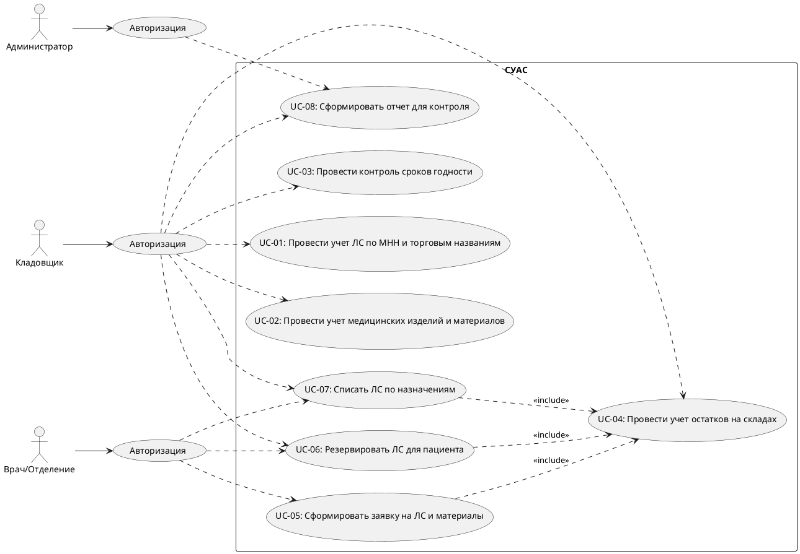
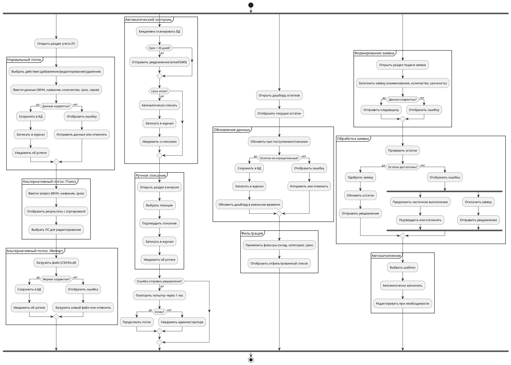
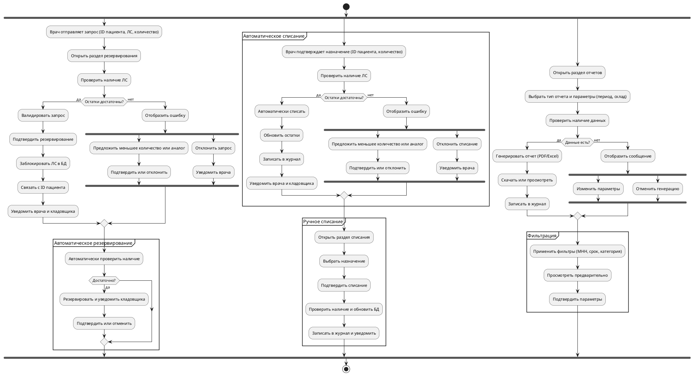
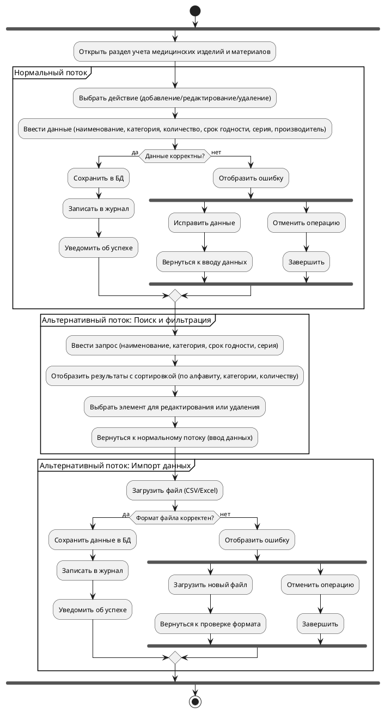

## Спецификация требований к программному обеспечению

**Название продукта:** Система управления аптекой и складами (СУАС) для больницы.  
**Версия:** 1.3
**Дата:** 16.10.2025  
**Автор:** Гуторов Иван ПИбд-31

### История версий

| Версия | Дата       | Автор        | Причина изменения               |
|--------|------------|--------------|---------------------------------|
| 1.0    | 16.10.2025 | Иван Гуторов | Первоначальная версия документа |
| 1.1    | 23.10.2025 | Иван Гуторов | Добавлено Приложение 2          |
| 1.2    | 23.10.2025 | Иван Гуторов | Добавлены пункты 4-6            |
| 1.3    | 30.10.2025 | Иван Гуторов | Добавлены требования к когнитивному интерфейсу | 

### Содержание

1. Введение  
   1.1. Назначение  
   1.2. Соглашения, принятые в документах  
   1.3. Предполагаемая аудитория и рекомендации по чтению  
   1.4. Ссылки  
2. Общее описание  
   2.1. Общий взгляд на продукт  
   2.2. Особенности продукта  
   2.3. Классы и характеристики пользователей  
   2.4. Операционная среда  
   2.5. Ограничения дизайна и реализации  
   2.6. Документация для пользователей  
3. Варианты использования  
   3.1. Перечень действующих лиц  
   3.2. Перечень вариантов использования  
   3.3. Определения вариантов использования  
4. Функциональные требования
5. Требования к внешнему интерфейсу
   5.1. Интерфейсы пользователя
   5.2. Интерфейсы оборудования
   5.3. Интерфейсы программного обеспечения
   5.4. Интерфейсы передачи информации
6. Другие нефункциональные требования
   6.1. Требования к производительности
   6.2. Атрибуты качества
Приложение 1. Словарь терминов
Приложение 2. Модели анализа
Приложение 3. Список вопросов

### Перечень таблиц

Таблица 2-1. Ограничения дизайна и реализации  
Таблица 3-2. Перечень действующих лиц  
Таблица 3-3. Перечень вариантов использования  

### 1. Введение

#### 1.1. Назначение

Назначение данного документа - определить пользовательские требования к программному обеспечению системы управления аптекой и складами (СУАС) для больницы. Документ охватывает аспекты учета лекарственных средств (ЛС), медицинских изделий и расходных материалов, контроля остатков, сроков годности, формирования заявок, резервирования и списания, а также отчетности. Он предназначен для обеспечения четкого понимания требований заказчика (руководства больницы) и их реализации в процессе разработки. Эта спецификация относится к модулю, ориентированному на пользователя - кладовщика, и является частью более крупной больничной информационной системы. Версия 1.0 фокусируется на базовом функционале для автоматизации логистики и минимизации потерь.

#### 1.2. Соглашения, принятые в документах

В рамках разработки требований приняты следующие соглашения:

- **Приоритет требований:**  
  - «1» - обязательные требования, без которых система не будет функционировать или не удовлетворит ключевым потребностям (например, учет ЛС).  
  - «2» - требования второй очереди, реализуемые после приоритета 1 (например, расширенные оповещения).  
  - «3» - желательные, реализуемые при наличии ресурсов (например, дополнительные фильтры).  
  - «4» - опциональные, переносимые на будущие итерации (например, интеграция с внешними API).  

- **Статус требований:**  
  - «С» - согласовано с заказчиком.  
  - «П» - предложение, на рассмотрении.  
  - «Т» - на тестировании.  
  - «У» - утверждено.  

- **Версия требований:** Первоначальная версия "1.0", при изменениях номер увеличивается (например, 1.1).  

- **Стили текста:** Требования нумеруются уникальными идентификаторами (например, UC-xx для вариантов использования, FR-xx для функциональных требований). Таблицы используются для структурированных данных. Сокращения расшифровываются в Приложении 1. Приоритет, указанный для требований высшего уровня, наследуется детализированными требованиями, если не указано иное. Требования формулируются однозначно, без двусмысленности.

#### 1.3. Предполагаемая аудитория и рекомендации по чтению

- **Заказчики (руководство больницы):** Ответственные за бизнес-требования и финансирование. Рекомендуется начать с раздела 1 (Введение) для понимания целей, затем перейти к разделу 2 (Общее описание) для обзора продукта. Для детального понимания бизнес-ценности ознакомьтесь с разделом 3 (Варианты использования).  

- **Менеджеры проекта:** Координируют разработку. Рекомендуется полный обзор, с акцентом на разделы 2.5 (Ограничения) и 3 (Варианты использования) для планирования.  

- **Разработчики ПО:** Реализуют систему. Начать с раздела 3 (Варианты использования) для понимания сценариев, затем изучить раздел 2 (Общее описание) для контекста.  

- **Тестировщики:** Проверяют соответствие. Фокус на разделе 3.3 (Определения вариантов использования) для тестовых сценариев.  

- **Кладовщики (пользователи):** Конечные пользователи. Рекомендуется раздел 2.2 (Особенности продукта) и 3 (Варианты использования) для понимания функционала.

- **Аналитики:** Для верификации. Рекомендуется последовательное чтение от начала.

#### 1.4. Ссылки

1. Документ об образе и границах проекта (Лабораторная работа № 1).  
2. Федеральный закон РФ № 61-ФЗ "Об обращении лекарственных средств".  
3. Федеральный закон РФ № 152-ФЗ "О персональных данных".  
4. Стандарт IEEE 830-1998 "Recommended Practice for Software Requirements Specifications".  
5. Стандарт IEEE 1233-1998 "Guide for Developing System Requirements Specifications".  
6. Национальный проект "Здравоохранение" (Минздрав РФ).  
7. Пример заполнения спецификации (Пример заполнения части таблиц Спецификации.docx).  
8. Шаблон спецификации требований (Спецификация требований (шаблон).docx).  
9. Лекция 2. Сбор требований заказчика (Лекция 2. Сбор требований заказчик.pdf).  

### 2. Общее описание

#### 2.1. Общий взгляд на продукт

СУАС - это специализированное ПО для автоматизации управления аптекой и складами в больнице, фокусирующееся на учете ЛС, материалов, контроле остатков и сроков годности. Продукт является новым модулем в рамках больничной информационной системы, заменяющим ручные журналы и Excel-таблицы. Он интегрируется с электронными картами пациентов и базами данных МНН, обеспечивая соответствие регуляторным требованиям (ФЗ-61, ФЗ-152). По сравнению с существующими решениями (например, 1C:Медицина), СУАС предлагает кастомизацию под процессы больницы, автоматизированные оповещения и резервирование ЛС. Продукт решает проблемы ошибок учета, просрочки и задержек поставок, соответствуя тенденциям цифровизации здравоохранения. Для полного функционирования требуется интеграция с больничной ИС и доступ к API Минздрава.

#### 2.2. Особенности продукта

- Автоматизированный учет ЛС по МНН и торговым названиям с CRUD-операциями, фильтрами и поиском.  
- Учет медицинских изделий и расходных материалов с CRUD.  
- Автоматический контроль сроков годности с оповещениями и автосписанием.  
- Мониторинг остатков в реальном времени.  
- Формирование и обработка заявок от отделений.  
- Резервирование ЛС для конкретных пациентов.  
- Списание ЛС и материалов по назначениям врачей.  
- Генерация отчетов для органов контроля (Росздравнадзор). 
- Когнитивный интерфейс: проактивные подсказки, автозаполнение форм, объяснение решений системы, контекстные предложения.

Группы требований иллюстрируются контекстной диаграммой в документе об образе проекта.

#### 2.3. Классы и характеристики пользователей

- **Кладовщик:** Основной пользователь, выполняющий ежедневные операции учета, контроля и отчетности. Характеристики: базовые навыки работы с ПО, доступ к системе через десктоп; привилегии - полный доступ к складу.  
- **Врачи/отделения:** Косвенные пользователи, подающие заявки; характеристики: ограниченный доступ (только заявки и статусы), интеграция через API.  
- **Администратор (IT-отдел/руководство):** Управляет пользователями и просматривает отчеты; характеристики: технические навыки, полный доступ, фокус на аналитике.  

Привилегированные классы: кладовщики (операции с данными), администраторы (управление).

#### 2.4. Операционная среда

- **Аппаратные средства:** Серверы больницы или облако (Яндекс.Облако), десктопы с Windows/Linux (минимум Intel i5, 8 ГБ RAM), сканеры штрих-кодов.  
- **Операционные системы:** Windows 10+, Linux (Ubuntu 20+).  
- **Сеть:** Локальная сеть больницы, стабильный интернет для интеграций.  
- **Базы данных:** PostgreSQL для хранения остатков и ЛС.  
- **Совместимость:** Интеграция с больничной ИС (электронные карты), API Минздрава. Географически: один больничный комплекс, до 50 пользователей.

#### 2.5. Ограничения дизайна и реализации

Таблица 2-1. Ограничения дизайна и реализации

| Идентификатор | Статус | Версия | Ограничение |
|---------------|--------|--------|-------------|
| C-01          | С      | 1.0    | Технологии: веб-приложение на Golang и Vue 3, после версии 1.0 мобильное приложение на Dart (Flutter). |
| C-02          | С      | 1.0    | Соответствие ФЗ-152: шифрование данных, ролевой доступ. |
| C-03          | С      | 1.0    | Совместимость с ОС Android 10+, Windows 10+ и Linux; браузеры Chrome/Firefox. |
| C-04          | С      | 1.0    | Обратная совместимость с legacy-системами больницы (экспорт в Excel). |
| C-05          | С      | 1.0    | Ограничения оборудования: отклик <2 сек, до 50 пользователей. |
| C-06          | С      | 1.0    | Язык интерфейса: русский; интеграция с API Минздрава для МНН, без внешних закупок. |

#### 2.6. Документация для пользователей

- **Руководство пользователя:** PDF с инструкциями по учету, контролю и отчетам; доступно в системе.  
- **FAQ:** Раздел в интерфейсе с ответами на типичные вопросы (например, "Как зарезервировать ЛС?").  
- **Онлайн-справка:** Встроенная в интерфейс, с туториалами. Форматы: PDF, HTML; стандарты - на русском языке.

### 3. Варианты использования

#### 3.1. Перечень действующих лиц

Таблица 3-2. Перечень действующих лиц

| Идентификатор | Действующее лицо |
|---------------|------------------|
| ACT-01        | Кладовщик        |
| ACT-02        | Врач/Отделение   |
| ACT-03        | Администратор    |

#### 3.2. Перечень вариантов использования

Таблица 3-3. Перечень вариантов использования

| Действ. лицо | Идентификатор | Статус | Приоритет | Версия | Вариант использования |
|--------------|---------------|--------|-----------|--------|-----------------------|
| ACT-01       | UC-01         | С      | 1         | 1.0    | Учет ЛС по МНН и торговым названиям |
| ACT-01       | UC-02         | С      | 1         | 1.0    | Учет медицинских изделий и материалов |
| ACT-01       | UC-03         | С      | 1         | 1.0    | Контроль сроков годности |
| ACT-01       | UC-04         | С      | 1         | 1.0    | Учет остатков на складах |
| ACT-02       | UC-05         | С      | 2         | 1.0    | Формирование заявок на ЛС и материалы |
| ACT-01, ACT-02 | UC-06       | С      | 2         | 1.0    | Резервирование ЛС для пациента |
| ACT-01, ACT-02 | UC-07       | С      | 2         | 1.0    | Списание ЛС по назначениям |
| ACT-01, ACT-03 | UC-08       | С      | 1         | 1.0    | Формирование отчетов для контроля |

#### 3.3. Определения вариантов использования

| **Идентификатор** | UC-01 |
|-------------------|-------|
| **Наименование** | Учет лекарственных средств (ЛС) по МНН и торговым названиям |
| **Первичное действующее лицо** | Кладовщик |
| **Другие действующие лица** | Нет |
| **Описание** | Кладовщик выполняет CRUD-операции (создание, чтение, обновление, удаление) над лекарственными средствами (ЛС) в системе, используя фильтры и поиск по международному непатентованному наименованию (МНН), торговому названию, сроку годности и остаткам. |
| **Предварительные условия** | 1. Кладовщик аутентифицирован в системе.  2. База данных (БД) с информацией о ЛС доступна.  3. Система имеет доступ к API для проверки МНН.  4. Пользователь имеет права на выполнение CRUD-операций. |
| **Выходные условия** | 1. Данные о ЛС успешно обновлены в базе данных.  2. Журнал операций (логирование добавления, изменения, удаления) сохранен в системе.  3. Кладовщик получает уведомление об успешном выполнении операции. |
| **Нормальный поток развития** | **UC-01.0. Учет ЛС**  1. Кладовщик открывает раздел учета ЛС в интерфейсе системы.  2. Кладовщик выбирает действие: добавление, редактирование или удаление ЛС.  3. Кладовщик вводит данные (МНН, торговое название, количество, срок годности, производитель, серия).  4. Система валидирует введенные данные (проверка формата МНН, корректности сроков годности, уникальности серии).  5. Если данные корректны, система сохраняет изменения в БД и записывает операцию в журнал.  6. Кладовщик получает уведомление об успешном выполнении операции. |
| **Альтернативный поток развития** | **UC-01.1. Поиск и фильтрация ЛС** (ответвление после этапа 1)  1. Кладовщик вводит запрос в поисковую строку (МНН, торговое название, срок годности, серия или остатки).  2. Система выполняет поиск в БД и отображает результаты в виде списка с возможностью сортировки (по алфавиту, сроку годности, остаткам).  3. Кладовщик выбирает ЛС из списка для редактирования или удаления.  4. Система перенаправляет на нормальный поток (этап 3).  **UC-01.2. Импорт данных из файла**  1. Кладовщик загружает файл (например, CSV/Excel) с данными ЛС.  2. Система проверяет формат файла и валидирует данные.  3. Если данные корректны, система сохраняет их в БД и записывает операцию в журнал.  4. Кладовщик получает уведомление об успешном импорте. **UC-01.3. Проактивное предложение аналогов** 1. При вводе МНН система анализирует остатки и предлагает аналог. 2. Кладовщик подтверждает кнопкой. 3. Система сохраняет выбор как предпочтение. |
| **Исключения** | **UC-01.0.E.1. Ошибка валидации данных** (на этапе 4)  1. Система отображает сообщение об ошибке (например, "Некорректный формат МНН" или "Срок годности истек").  **Вариант 1**  2. Кладовщик исправляет введенные данные.  3. Система возвращается к нормальному потоку (этап 4).  **Вариант 2**  2. Кладовщик отменяет операцию.  3. Система завершает вариант использования.  **UC-01.2.E.1. Ошибка импорта файла** (на этапе 2 UC-01.2)  1. Система отображает сообщение об ошибке (например, "Некорректный формат файла").  2. Кладовщик загружает новый файл или отменяет операцию. |
| **Включение** | Нет |
| **Частота использования** | Ежедневно, 50–100 операций в зависимости от объема работы склада. |
| **Ссылки** | FR-01-01, FR-01-02, FR-01-03 |
| **Предположения** | 1. Система имеет стабильный доступ к интернету.  2. Доступен API для проверки МНН.  3. Данные, введенные кладовщиком, соответствуют стандартам (например, МНН из справочника). |
| **Замечания и вопросы** | Необходимо определить:  – Требования к валидации МНН (например, проверка по международным стандартам).  – Форматы поддерживаемых файлов для импорта.  – Правила журналирования операций (какие данные сохранять).  – Максимальный объем данных для одной операции импорта.  – Требования к уникальности серий ЛС. |

| **Идентификатор** | UC-02 |
|-------------------|-------|
| **Наименование** | Учет медицинских изделий и материалов |
| **Первичное действующее лицо** | Кладовщик |
| **Другие действующие лица** | Нет |
| **Описание** | Кладовщик выполняет CRUD-операции (создание, чтение, обновление, удаление) над медицинскими изделиями и материалами, с фильтрацией и поиском по наименованию, категории, количеству и сроку годности. |
| **Предварительные условия** | 1. Кладовщик аутентифицирован в системе.  2. База данных с информацией о медицинских изделиях и материалах доступна.  3. Пользователь имеет права на выполнение операций. |
| **Выходные условия** | 1. Данные о медицинских изделиях и материалах обновлены в базе данных.  2. Журнал операций сохранен.  3. Кладовщик получает уведомление об успешном выполнении операции. |
| **Нормальный поток развития** | **UC-02.0. Учет медицинских изделий и материалов**  1. Кладовщик открывает раздел учета медицинских изделий и материалов в интерфейсе системы.  2. Кладовщик выбирает действие: добавление, редактирование или удаление.  3. Кладовщик вводит данные (наименование, категория, количество, срок годности, серия, производитель).  4. Система валидирует данные (проверка корректности сроков годности, уникальности серии).  5. Если данные корректны, система сохраняет изменения в БД и записывает операцию в журнал.  6. Кладовщик получает уведомление об успешной операции. |
| **Альтернативный поток развития** | **UC-02.1. Поиск и фильтрация** (ответвление после этапа 1)  1. Кладовщик вводит запрос в поисковую строку (наименование, категория, срок годности, серия).  2. Система отображает результаты в виде списка с возможностью сортировки (по алфавиту, категории, количеству).  3. Кладовщик выбирает элемент из списка для редактирования или удаления.  4. Система перенаправляет на нормальный поток (этап 3).  **UC-02.2. Импорт данных из файла**  1. Кладовщик загружает файл (например, CSV/Excel) с данными.  2. Система проверяет формат файла и валидирует данные.  3. Если данные корректны, система сохраняет их в БД и записывает операцию в журнал.  4. Кладовщик получает уведомление об успешном импорте. |
| **Исключения** | **UC-02.0.E.1. Ошибка валидации данных** (на этапе 4)  1. Система отображает сообщение об ошибке (например, "Некорректный срок годности").  **Вариант 1**  2. Кладовщик исправляет данные.  3. Система возвращается к нормальному потоку (этап 4).  **Вариант 2**  2. Кладовщик отменяет операцию.  3. Система завершает вариант использования.  **UC-02.2.E.1. Ошибка импорта файла** (на этапе 2 UC-02.2)  1. Система отображает сообщение об ошибке (например, "Неподдерживаемый формат файла").  2. Кладовщик загружает новый файл или отменяет операцию. |
| **Включение** | Нет |
| **Частота использования** | Ежедневно, в зависимости от поступлений и списаний (20–50 операций). |
| **Ссылки** | FR-02-01, FR-02-02 |
| **Предположения** | 1. Система имеет стабильный доступ к интернету.  2. Данные от поставщиков (наименование, серия, срок годности) достоверны.  3. Категории медицинских изделий стандартизированы. |
| **Замечания и вопросы** | Необходимо определить:  – Категории медицинских изделий и материалов.  – Требования к валидации сроков годности.  – Поддерживаемые форматы файлов для импорта.  – Правила журналирования операций.  – Ограничения на объем данных при импорте. |

| **Идентификатор** | UC-03 |
|-------------------|-------|
| **Наименование** | Контроль сроков годности ЛС и медицинских изделий |
| **Первичное действующее лицо** | Кладовщик |
| **Другие действующие лица** | Нет |
| **Описание** | Система автоматически мониторит сроки годности ЛС и медицинских изделий, отправляет уведомления за 30 дней до истечения срока и выполняет автоматическое списание просроченных позиций. Кладовщик может выполнять ручное списание. |
| **Предварительные условия** | 1. Данные о ЛС и медицинских изделиях с указанием сроков годности доступны в БД.  2. Email- и/или SMS-сервер для отправки уведомлений доступен.  3. Кладовщик аутентифицирован в системе для ручных операций. |
| **Выходные условия** | 1. Уведомления о приближении сроков годности отправлены.  2. Просроченные позиции списаны из БД.  3. Журнал списаний обновлен. |
| **Нормальный поток развития** | **UC-03.0. Автоматический контроль сроков**  1. Система ежедневно сканирует БД на наличие ЛС и медицинских изделий с истекающим сроком годности (менее 30 дней).  2. Система отправляет уведомления (email/SMS) кладовщику с указанием позиций, их количества и сроков годности.  3. Если срок годности истек, система автоматически списывает позиции из БД и фиксирует операцию в журнале.  4. Кладовщик получает уведомление о списании. |
| **Альтернативный поток развития** | **UC-03.1. Ручное списание** (ответвление после этапа 2)  1. Кладовщик открывает раздел контроля сроков годности.  2. Выбирает позиции с истекающим или истекшим сроком годности.  3. Подтверждает списание.  4. Система фиксирует операцию в журнале и обновляет БД.  5. Кладовщик получает уведомление об успешном списании.  **UC-03.2. Проактивное уведомление с предложением действий (ответвление после этапа 2 нормального потока)**  1. Система анализирует контекст (например, частота предыдущих списаний) и отображает всплывающее уведомление  2. Кладовщик выбирает действие кнопкой ("Списать", "Зарезервировать", "Игнорировать").  3. Если выбрано "Списать", система перенаправляет на UC-03.1 (этап 5).  4. Если выбрано "Зарезервировать", система интегрируется с UC-06 для резервирования.  5. Система сохраняет выбор как предпочтение для будущих уведомлений (адаптивность).  6. Кладовщик получает подтверждение действия с объяснением ("Списание выполнено для предотвращения потерь").  |
| **Исключения** | **UC-03.0.E.1. Ошибка отправки уведомлений** (на этапе 2)  1. Система фиксирует ошибку (например, "Сервер уведомлений недоступен").  2. Система повторяет попытку отправки через заданный интервал (например, через 1 час).  **Вариант 1**  3. Уведомление успешно отправлено.  4. Система возвращается к нормальному потоку (этап 3).  **Вариант 2**  3. Ошибка сохраняется, система уведомляет администратора. |
| **Включение** | Нет |
| **Частота использования** | Автоматически ежедневно, ручное списание — по необходимости (5–10 раз в месяц). |
| **Ссылки** | FR-03-01, FR-03-02 |
| **Предположения** | 1. Email- и SMS-серверы работают стабильно.  2. Данные о сроках годности в БД актуальны.  3. Кладовщик имеет доступ к уведомлениям. |
| **Замечания и вопросы** | Необходимо определить:  – Формат и содержимое уведомлений (email/SMS).  – Периодичность повторных попыток отправки уведомлений.  – Правила автоматического списания (например, подтверждение кладовщика).  – Возможность настройки периода уведомлений (например, 30/15/7 дней). |

| **Идентификатор** | UC-04 |
|-------------------|-------|
| **Наименование** | Учет остатков лекарственных средств и медицинских изделий на складах |
| **Первичное действующее лицо** | Кладовщик |
| **Другие действующие лица** | Нет |
| **Описание** | Кладовщик мониторит и обновляет остатки ЛС и медицинских изделий в реальном времени через дашборд, отражающий текущие запасы, поступления и списания. |
| **Предварительные условия** | 1. Кладовщик аутентифицирован в системе.  2. База данных с данными об остатках доступна.  3. Система поддерживает обновление данных в реальном времени. |
| **Выходные условия** | 1. Остатки ЛС и медицинских изделий обновлены в БД.  2. Дашборд отражает актуальные данные.  3. Журнал операций обновлен. |
| **Нормальный поток развития** | **UC-04.0. Учет остатков**  1. Кладовщик открывает дашборд учета остатков в интерфейсе системы.  2. Дашборд отображает текущие остатки ЛС и медицинских изделий (наименование, количество, срок годности, склад).  3. Кладовщик обновляет данные при поступлении (добавление) или списании (уменьшение) позиций.  4. Система валидирует данные (например, проверяет, чтобы остатки не стали отрицательными).  5. Система сохраняет изменения в БД и фиксирует операцию в журнале.  6. Дашборд обновляется в реальном времени. |
| **Альтернативный поток развития** | **UC-04.1. Фильтрация остатков** (ответвление после этапа 2)  1. Кладовщик применяет фильтры (например, по складу, категории, сроку годности).  2. Система отображает отфильтрованный список остатков.  3. Кладовщик выбирает позицию для обновления и переходит к нормальному потоку (этап 3). |
| **Исключения** | **UC-04.0.E.1. Отрицательные остатки** (на этапе 4)  1. Система отображает сообщение об ошибке (например, "Невозможно списать: недостаточно остатков").  **Вариант 1**  2. Кладовщик исправляет данные (например, уменьшает количество списания).  3. Система возвращается к нормальному потоку (этап 4).  **Вариант 2**  2. Кладовщик отменяет операцию.  3. Система завершает вариант использования. |
| **Включение** | Нет |
| **Частота использования** | Постоянно, при каждом поступлении или списании (50–200 операций в день). |
| **Ссылки** | FR-04-01, FR-04-02 |
| **Предположения** | 1. Система поддерживает обновление данных в реальном времени.  2. Данные о поступлениях и списаниях поступают своевременно.  3. Кладовщик имеет доступ к актуальной информации о складах. |
| **Замечания и вопросы** | Необходимо определить:  – Формат отображения дашборда (таблица, график, карточки).  – Периодичность обновления данных в реальном времени.  – Возможность настройки фильтров (например, по конкретным складам).  – Требования к журналированию операций. |

| **Идентификатор** | UC-05 |
|-------------------|-------|
| **Наименование** | Формирование заявок на лекарственные средства и медицинские изделия |
| **Первичное действующее лицо** | Врач/Отделение |
| **Другие действующие лица** | Кладовщик |
| **Описание** | Врач или отделение подает заявку на ЛС или медицинские изделия, кладовщик проверяет остатки и одобряет/отклоняет заявку. |
| **Предварительные условия** | 1. Врач/отделение аутентифицированы в системе.  2. База данных с данными об остатках доступна.  3. Кладовщик имеет права на обработку заявок. |
| **Выходные условия** | 1. Заявка обработана (одобрена или отклонена).  2. Уведомление о статусе заявки отправлено врачу/отделению.  3. При одобрении заявки остатки обновлены в БД. |
| **Нормальный поток развития** | **UC-05.0. Формирование и обработка заявки**  1. Врач/отделение открывает раздел подачи заявок в интерфейсе системы.  2. Врач/отделение заполняет заявку (наименование ЛС/изделия, количество, срочность).  3. Система валидирует данные заявки (проверка наличия позиций, корректности количества).  4. Заявка отправляется кладовщику.  5. Кладовщик проверяет остатки в БД.  6. Кладовщик одобряет или отклоняет заявку.  7. Система обновляет остатки (при одобрении) и отправляет уведомление врачу/отделению. |
| **Альтернативный поток развития** | **UC-05.1. Автозаполнение из шаблонов** (ответвление после этапа 1)  1. Врач/отделение выбирает шаблон заявки (например, для стандартных процедур).  2. Система автоматически заполняет поля заявки на основе шаблона.  3. Врач/отделение редактирует данные при необходимости.  4. Система возвращается к нормальному потоку (этап 3). **UC-05.2. Предложение аналогов при отсутствии ЛС (ответвление после этапа 6, если ЛС отсутствует)**  1. Система проверяет остатки и выявляет отсутствие.  2. Система отображает проактивное предложение: "Инсулин Лантус отсутствует. Доступен аналог: Инсулин Хумалог, 10 фл. в наличии. Использовать?" с кнопками "Да", "Нет", "Показать все аналоги". 3. При выборе "Да" — система резервирует аналог, добавляет примечание в заявку: "Заменено по предложению системы". 4. При выборе "Нет" — заявка помечается как "На рассмотрении", уведомление уходит кладовщику. 5. Система фиксирует выбор для адаптации будущих предложений. **UC-05.3. Уточнение неопределённого запроса (ответвление при неоднозначности на этапе 2 UC-05.1**  1. Врач вводит: "Антибиотик для пациента №123". 2. Система анализирует ЭМК и предлагает варианты: "Уточните: 1) Амоксициллин 500 мг (по назначению), 2) Цефтриаксон 1 г (по диагнозу), 3) Другое". 3. Врач выбирает вариант → система переходит к автозаполнению (UC-05.1, этап 3). 4. Система сохраняет уточнение как предпочтение.
| **Исключения** | **UC-05.0.E.1. Недостаток остатков** (на этапе 5)  1. Система отображает сообщение об ошибке (например, "Недостаточно остатков для выполнения заявки").  **Вариант 1**  2. Кладовщик предлагает частичное выполнение заявки (если возможно).  3. Врач/отделение подтверждает или отклоняет частичное выполнение.  4. Система возвращается к нормальному потоку (этап 6).  **Вариант 2**  2. Кладовщик отклоняет заявку.  3. Система отправляет уведомление врачу/отделению и завершает вариант использования. |
| **Включение** | UC-04 (Учет остатков на складах) |
| **Частота использования** | 20–50 заявок в день, в зависимости от размера учреждения. |
| **Ссылки** | FR-05-01, FR-05-02 |
| **Предположения** | 1. Система интегрирована с модулем управления отделениями.  2. Данные о потребностях отделений стандартизированы.  3. Уведомления доставляются своевременно. |
| **Замечания и вопросы** | Необходимо определить:  – Формат заявок и шаблонов.  – Правила приоритизации срочных заявок.  – Возможность частичного выполнения заявок.  – Требования к уведомлениям (email, push-уведомления). |

| **Идентификатор** | UC-06 |
|-------------------|-------|
| **Наименование** | Резервирование лекарственных средств для пациента |
| **Первичное действующее лицо** | Кладовщик |
| **Другие действующие лица** | Врач |
| **Описание** | Кладовщик резервирует ЛС для конкретного пациента по запросу врача, используя идентификатор пациента (ID) из информационной системы (ИС). |
| **Предварительные условия** | 1. Назначение ЛС подтверждено врачом в ИС.  2. Кладовщик аутентифицирован в системе.  3. База данных с данными об остатках и назначениях доступна. |
| **Выходные условия** | 1. ЛС зарезервировано для пациента в БД.  2. Остатки обновлены (зарезервированные позиции заблокированы).  3. Врач и кладовщик получают уведомление о резервировании. |
| **Нормальный поток развития** | **UC-06.0. Резервирование ЛС**  1. Врач отправляет запрос на резервирование ЛС с указанием ID пациента, наименования ЛС и количества.  2. Кладовщик открывает раздел резервирования в интерфейсе системы.  3. Кладовщик проверяет наличие ЛС в БД.  4. Система валидирует запрос (проверка остатков, соответствия назначению).  5. Кладовщик подтверждает резервирование.  6. Система блокирует указанное количество ЛС в БД и связывает его с ID пациента.  7. Врач и кладовщик получают уведомление об успешном резервировании. |
| **Альтернативный поток развития** | **UC-06.1. Автоматическое резервирование** (ответвление после этапа 1)  1. Система автоматически проверяет наличие ЛС по запросу врача.  2. Если остатки достаточны, система резервирует ЛС и уведомляет кладовщика для подтверждения.  3. Кладовщик подтверждает или отменяет резервирование.  4. Система возвращается к нормальному потоку (этап 6). |
| **Исключения** | **UC-06.0.E.1. Недостаток остатков** (на этапе 4)  1. Система отображает сообщение об ошибке (например, "Недостаточно ЛС для резервирования").  **Вариант 1**  2. Кладовщик предлагает зарезервировать меньшее количество или заменить ЛС аналогом.  3. Врач подтверждает или отклоняет предложение.  4. Система возвращается к нормальному потоку (этап 5).  **Вариант 2**  2. Кладовщик отклоняет запрос.  3. Система уведомляет врача и завершает вариант использования. |
| **Включение** | UC-04 (Учет остатков на складах) |
| **Частота использования** | По мере назначения ЛС пациентам (10–50 раз в день). |
| **Ссылки** | FR-06-01, FR-06-02 |
| **Предположения** | 1. Система интегрирована с электронными медицинскими картами (ЭМК).  2. ID пациента уникален и синхронизирован с ИС.  3. Данные о назначениях актуальны. |
| **Замечания и вопросы** | Необходимо определить:  – Формат запросов на резервирование (например, через ЭМК).  – Правила замены ЛС аналогами.  – Срок действия резерва (например, 24 часа).  – Формат уведомлений о резервировании. |

| **Идентификатор** | UC-07 |
|-------------------|-------|
| **Наименование** | Списание лекарственных средств по назначениям |
| **Первичное действующее лицо** | Кладовщик |
| **Другие действующие лица** | Врач |
| **Описание** | Кладовщик выполняет автоматическое или ручное списание ЛС на основе подтвержденных назначений врача, обновляя остатки в системе. |
| **Предварительные условия** | 1. Назначение ЛС подтверждено врачом в информационной системе (ИС).  2. Кладовщик аутентифицирован в системе.  3. База данных с данными об остатках и назначениях доступна. |
| **Выходные условия** | 1. ЛС списаны из БД.  2. Остатки обновлены.  3. Журнал списаний обновлен.  4. Врач и кладовщик получают уведомление о списании. |
| **Нормальный поток развития** | **UC-07.0. Автоматическое списание ЛС**  1. Врач подтверждает назначение ЛС в ИС с указанием ID пациента и количества.  2. Система проверяет наличие ЛС в БД.  3. Если остатки достаточны, система автоматически списывает указанное количество ЛС.  4. Система обновляет остатки в БД и фиксирует операцию в журнале.  5. Врач и кладовщик получают уведомление о списании. |
| **Альтернативный поток развития** | **UC-07.1. Ручное списание** (ответвление после этапа 1)  1. Кладовщик открывает раздел списания ЛС в интерфейсе системы.  2. Кладовщик выбирает назначение из списка подтвержденных врачом.  3. Кладовщик подтверждает списание.  4. Система проверяет наличие ЛС и обновляет остатки в БД.  5. Система фиксирует операцию в журнале и отправляет уведомления врачу и кладовщику. |
| **Исключения** | **UC-07.0.E.1. Недостаток остатков** (на этапе 3 или 4)  1. Система отображает сообщение об ошибке (например, "Недостаточно ЛС для списания").  **Вариант 1**  2. Кладовщик предлагает списать меньшее количество или заменить ЛС аналогом.  3. Врач подтверждает или отклоняет предложение.  4. Система возвращается к нормальному потоку (этап 3 или 4).  **Вариант 2**  2. Кладовщик отклоняет списание.  3. Система уведомляет врача и завершает вариант использования. |
| **Включение** | UC-04 (Учет остатков на складах) |
| **Частота использования** | Ежедневно, в зависимости от количества назначений (20–100 операций). |
| **Ссылки** | FR-07-01, FR-07-02 |
| **Предположения** | 1. Система интегрирована с ИС (например, ЭМК).  2. Данные о назначениях актуальны и подтверждены.  3. Уведомления доставляются своевременно. |
| **Замечания и вопросы** | Необходимо определить:  – Правила автоматического списания (например, необходимость подтверждения кладовщика).  – Возможность замены ЛС аналогами.  – Формат уведомлений о списании.  – Срок хранения записей в журнале списаний. |

| **Идентификатор** | UC-08 |
|-------------------|-------|
| **Наименование** | Формирование отчетов для контроля остатков и списаний |
| **Первичное действующее лицо** | Кладовщик |
| **Другие действующие лица** | Администратор |
| **Описание** | Кладовщик или администратор генерирует отчеты по остаткам, списаниям, резервированиям и другим операциям с ЛС и медицинскими изделиями в форматах PDF или Excel. |
| **Предварительные условия** | 1. Кладовщик или администратор аутентифицированы в системе.  2. База данных с данными об остатках, списаниях и других операциях доступна.  3. Система поддерживает экспорт данных в PDF/Excel. |
| **Выходные условия** | 1. Отчет сгенерирован и доступен для скачивания/просмотра.  2. Журнал операций по генерации отчетов обновлен. |
| **Нормальный поток развития** | **UC-08.0. Формирование отчета**  1. Кладовщик или администратор открывает раздел отчетов в интерфейсе системы.  2. Пользователь выбирает тип отчета (например, остатки, списания, резервирования) и параметры (период, склад, категория).  3. Система проверяет наличие данных в БД.  4. Система генерирует отчет в выбранном формате (PDF/Excel).  5. Пользователь скачивает или просматривает отчет.  6. Система фиксирует операцию в журнале. |
| **Альтернативный поток развития** | **UC-08.1. Фильтрация данных для отчета** (ответвление после этапа 2)  1. Пользователь применяет дополнительные фильтры (например, по МНН, сроку годности, складу).  2. Система отображает предварительный просмотр данных.  3. Пользователь подтверждает параметры и возвращается к нормальному потоку (этап 4). |
| **Исключения** | **UC-08.0.E.1. Нет данных для отчета** (на этапе 3)  1. Система отображает сообщение (например, "Данные за указанный период отсутствуют").  **Вариант 1**  2. Пользователь изменяет параметры отчета (например, период или категорию).  3. Система возвращается к нормальному потоку (этап 3).  **Вариант 2**  2. Пользователь отменяет генерацию отчета.  3. Система завершает вариант использования. |
| **Включение** | Нет |
| **Частота использования** | Еженедельно или по запросу (5–20 отчетов в неделю). |
| **Ссылки** | FR-08-01, FR-08-02 |
| **Предположения** | 1. Данные в БД соответствуют нормативным требованиям.  2. Система поддерживает экспорт в PDF/Excel.  3. Пользователи имеют доступ к отчетам в соответствии с правами. |
| **Замечания и вопросы** | Необходимо определить:  – Типы отчетов (например, по складам, категориям, операциям).  – Форматы экспорта (PDF, Excel, другие).  – Период хранения сгенерированных отчетов.  – Возможность настройки шаблонов отчетов.  – Требования к фильтрам и сортировке данных. |

### 4. Функциональные требования

Функциональные требования детализируют поведение системы на основе вариантов использования. Они включают обработку нормальных потоков, альтернативных и исключений. Приоритет наследуется от соответствующих UC, если не указано иное. Требования, общие для нескольких UC (например, валидация данных), имеют нулевой номер UC (FR-00-xx).

Таблица 4-4. Функциональные требования

| Идентификатор | Статус | Приоритет | Версия | Функциональное требование |
|---------------|--------|-----------|--------|---------------------------|
| FR-00-01      | С      | 1         | 1.0    | Система должна валидировать все вводимые данные (например, МНН, сроки годности, количества) на соответствие форматам и логике (например, срок годности > текущей даты, количество > 0). При ошибке отображать сообщение с описанием. |
| FR-00-02      | С      | 1         | 1.0    | Система должна вести журнал операций (логирование добавления, изменения, удаления, списания) с указанием пользователя, даты, времени и деталей операции. Журнал хранится в БД и доступен администратору. |
| FR-00-03      | С      | 1         | 1.0    | Система должна обеспечивать аутентификацию пользователей по логину/паролю с ролью (кладовщик, врач, администратор) и проверкой прав доступа перед выполнением операций. |
| FR-01-01      | С      | 1         | 1.0    | Система должна поддерживать CRUD-операции над ЛС с вводом/поиском по МНН, торговому названию, серии, производителю, количеству и сроку годности. |
| FR-01-02      | С      | 1         | 1.0    | Система должна обеспечивать поиск и фильтрацию ЛС с сортировкой (по алфавиту, сроку, остаткам) и отображением результатов в табличном виде. |
| FR-01-03      | С      | 1         | 1.0    | Система должна поддерживать импорт данных ЛС из файлов (CSV/Excel) с валидацией и автоматическим сохранением в БД. При ошибке формата - отображать сообщение. |
| FR-02-01      | С      | 1         | 1.0    | Система должна поддерживать CRUD-операции над медицинскими изделиями и материалами с вводом/поиском по наименованию, категории, серии, производителю, количеству и сроку годности. |
| FR-02-02      | С      | 1         | 1.0    | Система должна обеспечивать поиск и фильтрацию медицинских изделий/материалов с сортировкой и отображением результатов. |
| FR-03-01      | С      | 1         | 1.0    | Система должна автоматически сканировать БД ежедневно и отправлять уведомления (email/SMS) о приближающихся сроках годности (за 30 дней) с деталями позиций. |
| FR-03-02      | С      | 1         | 1.0    | Система должна автоматически списывать просроченные позиции, обновлять БД и фиксировать в журнале. Поддерживать ручное списание с подтверждением. |
| FR-04-01      | С      | 1         | 1.0    | Система должна отображать дашборд с реальными остатками (наименование, количество, срок, склад) и обновлять его в реальном времени при операциях. |
| FR-04-02      | С      | 1         | 1.0    | Система должна предотвращать отрицательные остатки при обновлении, отображая ошибку и предлагая корректировку. |
| FR-05-01      | С      | 2         | 1.0    | Система должна позволять формировать заявки с валидацией (наименование, количество, срочность) и отправлять их кладовщику для обработки. |
| FR-05-02      | С      | 2         | 1.0    | Система должна проверять остатки при обработке заявки, поддерживать частичное выполнение и отправлять уведомления о статусе. |
| FR-06-01      | С      | 2         | 1.0    | Система должна резервировать ЛС по ID пациента, блокируя количество в БД и связывая с назначением. |
| FR-06-02      | С      | 2         | 1.0    | Система должна проверять остатки при резервировании, предлагать альтернативы при недостатке и отправлять уведомления. |
| FR-07-01      | С      | 2         | 1.0    | Система должна автоматически списывать ЛС по подтвержденным назначениям, обновляя остатки и фиксируя в журнале. |
| FR-07-02      | С      | 2         | 1.0    | Система должна поддерживать ручное списание с проверкой остатков и уведомлениями. |
| FR-08-01      | С      | 1         | 1.0    | Система должна генерировать отчеты по параметрам (период, тип, фильтры) в форматах PDF/Excel. |
| FR-08-02      | С      | 1         | 1.0    | Система должна отображать предварительный просмотр отчета и фиксировать генерацию в журнале. |

### 5. Требования к внешнему интерфейсу

#### 5.1. Интерфейсы пользователя

Интерфейсы пользователя следуют стандартам Material Design (для веб) и Human Interface Guidelines (для мобильных версий после 1.0). Шрифты: sans-serif (Arial/Roboto, 14 pt). Цветовая схема: синий/белый для медицинской тематики. Разрешение: responsive (от 1024x768). Стандартные элементы: кнопки (Сохранить, Отменить), поисковая строка, дашборд с таблицами/графиками. Быстрые клавиши: Ctrl+S (сохранить), Ctrl+F (поиск). Сообщения: модальные окна с иконками (ошибка - красный, успех - зеленый). Поддержка локализации (русский). Специальные возможности: экранный ридер для слабовидящих.

Таблица 5-5. Интерфейсы пользователя

| Идентификатор | Статус | Версия | Интерфейс пользователя |
|---------------|--------|--------|------------------------|
| IU-01         | С      | 1.0    | Дашборд остатков: таблица с колонками (наименование, количество, срок, действия), фильтры и поиск. |
| IU-02         | С      | 1.0    | Форма учета ЛС: поля ввода (МНН, название, количество, срок), кнопки CRUD. |
| IU-03         | С      | 1.0    | Раздел заявок: список заявок с статусами, кнопки одобрения/отклонения. |
| IU-04         | С      | 1.0    | Отчеты: выбор параметров, предварительный просмотр, экспорт. |
| IU-05         | С      | 1.0    | Уведомления: модальные окна или панель с оповещениями о сроках/заявках. |
| IU-06         | С      | 1.4    | Умный поиск с автодополнением: при вводе МНН/наименования — выпадающий список с предложениями, включая аналоги.|
| IU-07         | С      | 1.4    | Проактивные подсказки: всплывающие карточки "Остатки < 10 уп.", "Срок годности истекает", с кнопками "Заказать", "Списать".|
| IU-08         | С      | 1.4    | Кнопка "Почему?": при автосписании, отказе в заявке — объяснение ("Недостаточно остатков", "Просрочено").|
| IU-09         | С      | 1.4    | Автозаполнение по контексту: при вводе ID пациента — подтягивание назначений из ЭМК.|

#### 5.2. Интерфейсы оборудования

Поддержка сканеров штрих-кодов для ввода серий/МНН. Протоколы: USB/HID. Ограничения: совместимость с моделями Honeywell/Motorola.

Таблица 5-6. Интерфейсы оборудования

| Идентификатор | Статус | Версия | Интерфейс оборудования |
|---------------|--------|--------|------------------------|
| IH-01         | С      | 1.0    | Сканер штрих-кодов: ввод серий ЛС/материалов в формы учета. |
| IH-02         | С      | 1.0    | Принтер этикеток: печать штрих-кодов для новых позиций (протокол ZPL). |

#### 5.3. Интерфейсы программного обеспечения

Интеграция с PostgreSQL (версия 13+), API Минздрава для МНН (REST/JSON). Библиотеки: Gin (Golang), Axios (Vue). Доступ к данным: SQL-запросы, глобальная область для сессий пользователей.

Таблица 5-7. Интерфейсы программного обеспечения

| Идентификатор | Статус | Версия | Интерфейс программного обеспечения |
|---------------|--------|--------|-------------------------------------|
| IS-01         | С      | 1.0    | PostgreSQL: хранение данных ЛС, остатков, журналов (CRUD через ORM). |
| IS-02         | С      | 1.0    | API Минздрава: запросы на валидацию МНН (GET/POST, JSON). |
| IS-03         | С      | 1.0    | Интеграция с ЭМК: обмен данными о пациентах/ID (REST API). |

#### 5.4. Интерфейсы передачи информации

Поддержка email (SMTP) для уведомлений, SMS через внешний сервис (Twilio/SMS.ru). Форматы: JSON для API, XML для отчетов. Шифрование: HTTPS/TLS. Частота: реальное время для обновлений, ежедневно для сканов.

Таблица 5-8. Интерфейсы передачи информации

| Идентификатор | Статус | Версия | Интерфейс передачи информации |
|---------------|--------|--------|-------------------------------|
| IC-01         | С      | 1.0    | Email: уведомления о сроках/заявках (SMTP, HTML-текст). |
| IC-02         | С      | 1.0    | SMS: срочные оповещения (API Twilio, текст до 160 символов). |
| IC-03         | С      | 1.0    | API-интеграция: обмен с внешними системами (HTTPS, JSON). |

### 6. Другие нефункциональные требования

#### 6.1. Требования к производительности

Требования учитывают нагрузку до 50 пользователей, отклик <2 сек в стандартных условиях. Снижение производительности при пиковых нагрузках (например, конец смены) - не более 20%.

Таблица 6-9. Требования к производительности

| Идентификатор | Статус | Приоритет | Версия | Требование к производительности |
|---------------|--------|-----------|--------|---------------------------------|
| PR-01         | С      | 1         | 1.0    | Время отклика на CRUD-операции: <1 сек при нагрузке до 10 пользователей. |
| PR-02         | С      | 1         | 1.0    | Пропускная способность: до 200 операций/мин (учет, списание). |
| PR-03         | С      | 2         | 1.0    | Генерация отчета: <5 сек для периода 1 месяц, <10 сек для года. |
| PR-04         | С      | 1         | 1.0    | Автоматический скан БД: ежедневно, <1 мин для 10 000 позиций. |

#### 6.2. Атрибуты качества

Атрибуты включают видимые (удобство, надежность) и скрытые (тестируемость). Система должна быть устойчивой к сбоям (автобэкап БД).

Таблица 6-10. Атрибуты качества

| Идентификатор | Статус | Приоритет | Версия | Атрибут качества |
|---------------|--------|-----------|--------|------------------|
| QA-01         | С      | 1         | 1.0    | Надежность: MTBF >99.9%, автобэкап БД ежедневно. |
| QA-02         | С      | 1         | 1.0    | Удобство использования: интуитивный интерфейс, обучение <1 час. |
| QA-03         | С      | 2         | 1.0    | Безопасность: шифрование данных (AES-256), ролевой доступ. |
| QA-04         | С      | 1         | 1.0    | Масштабируемость: поддержка до 100 пользователей без деградации. |
| QA-05         | С      | 2         | 1.0    | Тестируемость: модульные тесты >80% покрытия кода. |
| QA-06         | С      | 1         | 1.4    | Естественность взаимодействия: распознавание разговорной речи в текстовом вводе (опечатки, синонимы), привычные паттерны форм.|
| QA-07         | С      | 1         | 1.4    | Проактивность: предугадывание действий (например, предложение заказа при остатке < порога).|
| QA-08         | С      | 1         | 1.4    | Прозрачность: объяснение всех автоматизированных решений (автосписание, отказ в заявке).|
| QA-09         | С      | 1         | 1.4    | Снижение когнитивной нагрузки: автозаполнение, шаблоны, минимизация переключений между экранами.|
| QA-10         | С      | 2         | 1.4    | Контекстная релевантность: отображение только нужной информации по текущей задаче (например, при вводе заявки — только доступные ЛС).|
| QA-11         | С      | 1         | 1.4    | Обратная связь: статус "Думаю...", "Готово", "Ошибка" — визуально (анимация, индикаторы).|
| QA-12         | С      | 1         | 1.4    | Управление доверием: кнопки "Отменить", "Не предлагать", "Настроить подсказки".|
| QA-13         | С      | 1         | 1.4    | Работа в неопределённости: уточнение запросов ("Вы имели в виду Ибупрофен 200 мг или 400 мг?").|
| QA-14         | С      | 1         | 1.4    | Доступность: поддержка экранных читалок, крупных шрифтов, контрастных тем.|

### Приложение 1. Словарь терминов

| Сокращение, термин | Расшифровка сокращения или термина |
|---------------------|------------------------------------|
| ЛС                 | Лекарственные средства             |
| МНН                | Международное непатентованное название |
| CRUD               | Create, Read, Update, Delete       |
| ИС                 | Информационная система             |
| БД                 | База данных                        |
| ФЗ-152             | Федеральный закон "О персональных данных" |
| ФЗ-61              | Федеральный закон "Об обращении лекарственных средств" |
| ROI                | Return on Investment (возврат инвестиций) |
| KPI                | Key Performance Indicators (ключевые показатели эффективности) |
| Когнитивный интерфейс | Интерфейс, минимизирующий умственное усилие, использующий естественные паттерны (голос, жесты, предсказания). |
| Проактивность | Система предугадывает действия пользователя до явного запроса. |
| Прозрачность | Объяснение причин решений системы. |

### Приложение 2. Модели анализа

#### Диаграмма вариантов использования (Use Case Diagram)

%% ![[Pasted image 20251023230025.png]]  %% 

#### Диаграмма деятельности (Activity Diagram) для основных бизнес-процессов

%% ![[Pasted image 20251023231504.png]] %%

%%  ![[Pasted image 20251023232934.png]]  %%

%% ![[Pasted image 20251023233538.png]] %%

#### Диаграмма состояний (State Diagram) для основных бизнес-процессов

```plantuml-svg
@startuml
[*] --> NotAuthenticated

state NotAuthenticated {
  [*] --> Login
  Login --> Authenticate : Ввести логин/пароль
  Authenticate --> Authenticated : Успешная аутентификация
  Authenticate --> LoginFailed : Неверные данные
  LoginFailed --> Login : Повторить попытку
  LoginFailed --> [*] : Отменить
}

state Authenticated {
  [*] --> MainMenu

  state UC01_UC02_UC04 {
    [*] --> OpenSection
    OpenSection --> SelectAction : Выбрать действие (учет ЛС/изделий/остатков)
    SelectAction --> EnterData : Ввести данные
    EnterData --> ValidateData
    ValidateData --> SaveToDB : Данные корректны
    SaveToDB --> LogOperation
    LogOperation --> NotifySuccess
    NotifySuccess --> OpenSection

    ValidateData --> DisplayError : Данные некорректны
    DisplayError --> CorrectData : Исправить данные
    CorrectData --> EnterData
    DisplayError --> CancelOperation : Отменить
    CancelOperation --> OpenSection

    state SearchFilter {
      [*] --> EnterQuery
      EnterQuery --> DisplayResults
      DisplayResults --> SelectItem
      SelectItem --> EnterData
    }

    state ImportData {
      [*] --> UploadFile
      UploadFile --> CheckFormat
      CheckFormat --> SaveToDBImport : Формат корректен
      SaveToDBImport --> LogOperationImport
      LogOperationImport --> NotifySuccessImport
      NotifySuccessImport --> OpenSection

      CheckFormat --> DisplayErrorImport : Формат некорректен
      DisplayErrorImport --> UploadNewFile : Загрузить новый файл
      UploadNewFile --> CheckFormat
      DisplayErrorImport --> CancelImport : Отменить
      CancelImport --> OpenSection
    }

    OpenSection --> SearchFilter : Поиск/фильтрация
    OpenSection --> ImportData : Импорт данных
  }

  state UC03 {
    [*] --> DailyScan
    DailyScan --> CheckExpiryNear : Срок < 30 дней
    CheckExpiryNear --> SendNotification
    SendNotification --> CheckExpiryPassed
    CheckExpiryPassed --> AutoWriteOff : Срок истек
    AutoWriteOff --> LogWriteOff
    LogWriteOff --> NotifyWriteOff
    NotifyWriteOff --> DailyScan

    CheckExpiryNear --> CheckExpiryPassed : Срок >= 30 дней
    CheckExpiryPassed --> DailyScan : Срок не истек

    SendNotification --> LogError : Ошибка отправки
    LogError --> RetrySend : Повторить через 1 час
    RetrySend --> SendNotification : Успех
    RetrySend --> NotifyAdmin : Неуспех
    NotifyAdmin --> DailyScan

    state ManualWriteOff {
      [*] --> OpenControlSection
      OpenControlSection --> SelectItems
      SelectItems --> ConfirmWriteOff
      ConfirmWriteOff --> LogManual
      LogManual --> NotifyManualSuccess
      NotifyManualSuccess --> DailyScan
    }

    DailyScan --> ManualWriteOff : Ручное списание
  }

  state UC05 {
    [*] --> OpenRequestSection
    OpenRequestSection --> FillRequest : Заполнить заявку
    FillRequest --> ValidateRequestData
    ValidateRequestData --> SendToStorekeeper : Данные корректны
    SendToStorekeeper --> CheckStocks
    CheckStocks --> ApproveRequest : Остатки достаточны
    ApproveRequest --> UpdateStocksRequest
    UpdateStocksRequest --> SendNotificationRequest
    SendNotificationRequest --> OpenRequestSection

    ValidateRequestData --> DisplayRequestError : Данные некорректны
    DisplayRequestError --> FillRequest

    CheckStocks --> DisplayErrorRequest : Недостаточно остатков
    DisplayErrorRequest --> ProposePartial : Предложить частичное выполнение
    ProposePartial --> ConfirmPartial : Подтвердить
    ConfirmPartial --> ApproveRequest
    ProposePartial --> RejectPartial : Отклонить
    RejectPartial --> SendRejectNotification
    SendRejectNotification --> OpenRequestSection

    DisplayErrorRequest --> RejectRequest : Отклонить заявку
    RejectRequest --> SendRejectNotification

    state AutoFill {
      [*] --> SelectTemplate
      SelectTemplate --> AutoFillFields
      AutoFillFields --> EditIfNeeded
      EditIfNeeded --> ValidateRequestData
    }

    OpenRequestSection --> AutoFill : Автозаполнение
  }

  state UC06 {
    [*] --> DoctorSendRequest
    DoctorSendRequest --> OpenReservationSection
    OpenReservationSection --> CheckAvailability
    CheckAvailability --> ValidateReservationRequest : Остатки достаточны
    ValidateReservationRequest --> ConfirmReservation
    ConfirmReservation --> BlockStock
    BlockStock --> LinkToPatientID
    LinkToPatientID --> NotifyDoctorAndStorekeeper
    NotifyDoctorAndStorekeeper --> OpenReservationSection

    CheckAvailability --> DisplayReservationError : Недостаточно остатков
    DisplayReservationError --> ProposeAlternative : Предложить меньшее/аналог
    ProposeAlternative --> ConfirmAlternative : Подтвердить
    ConfirmAlternative --> ConfirmReservation
    ProposeAlternative --> RejectAlternative : Отклонить
    RejectAlternative --> NotifyDoctorReject
    NotifyDoctorReject --> OpenReservationSection

    DisplayReservationError --> RejectReservationRequest : Отклонить
    RejectReservationRequest --> NotifyDoctorReject

    state AutoReservation {
      [*] --> AutoCheckAvailability
      AutoCheckAvailability --> AutoReserve : Достаточно остатков
      AutoReserve --> NotifyStorekeeperForConfirm
      NotifyStorekeeperForConfirm --> ConfirmOrCancel
      ConfirmOrCancel --> BlockStock : Подтвердить
      ConfirmOrCancel --> OpenReservationSection : Отменить
    }

    DoctorSendRequest --> AutoReservation : Автоматическое резервирование
  }

  state UC07 {
    [*] --> DoctorConfirmAppointment
    DoctorConfirmAppointment --> CheckAvailabilityWriteOff : Автоматическое списание
    CheckAvailabilityWriteOff --> AutoWriteOffAction : Остатки достаточны
    AutoWriteOffAction --> UpdateStocksWriteOff
    UpdateStocksWriteOff --> LogWriteOffAction
    LogWriteOffAction --> NotifyDoctorAndStorekeeperWriteOff
    NotifyDoctorAndStorekeeperWriteOff --> DoctorConfirmAppointment

    CheckAvailabilityWriteOff --> DisplayWriteOffError : Недостаточно остатков
    DisplayWriteOffError --> ProposeAlternativeWriteOff : Предложить меньшее/аналог
    ProposeAlternativeWriteOff --> ConfirmAlternativeWriteOff : Подтвердить
    ConfirmAlternativeWriteOff --> AutoWriteOffAction
    ProposeAlternativeWriteOff --> RejectAlternativeWriteOff : Отклонить
    RejectAlternativeWriteOff --> NotifyDoctorWriteOffReject
    NotifyDoctorWriteOffReject --> DoctorConfirmAppointment

    DisplayWriteOffError --> RejectWriteOff : Отклонить
    RejectWriteOff --> NotifyDoctorWriteOffReject

    state ManualWriteOffState {
      [*] --> OpenWriteOffSection
      OpenWriteOffSection --> SelectAppointment
      SelectAppointment --> ConfirmWriteOffManual
      ConfirmWriteOffManual --> CheckAndUpdateDB
      CheckAndUpdateDB --> LogAndNotifyManual
      LogAndNotifyManual --> DoctorConfirmAppointment
    }

    DoctorConfirmAppointment --> ManualWriteOffState : Ручное списание
  }

  state UC08 {
    [*] --> OpenReportsSection
    OpenReportsSection --> SelectReportTypeAndParams
    SelectReportTypeAndParams --> CheckDataAvailability
    CheckDataAvailability --> GenerateReportFile : Данные есть
    GenerateReportFile --> DownloadOrView
    DownloadOrView --> LogReportOperation
    LogReportOperation --> OpenReportsSection

    CheckDataAvailability --> DisplayNoDataMessage : Нет данных
    DisplayNoDataMessage --> ChangeParams : Изменить параметры
    ChangeParams --> CheckDataAvailability
    DisplayNoDataMessage --> CancelGeneration : Отменить
    CancelGeneration --> OpenReportsSection

    state FilterReport {
      [*] --> ApplyAdditionalFilters
      ApplyAdditionalFilters --> PreviewData
      PreviewData --> ConfirmParams
      ConfirmParams --> GenerateReportFile
    }

    OpenReportsSection --> FilterReport : Фильтрация
  }

  MainMenu --> UC01_UC02_UC04 : Учет ЛС/изделий/остатков
  MainMenu --> UC03 : Контроль сроков годности
  MainMenu --> UC05 : Формирование заявок
  MainMenu --> UC06 : Резервирование ЛС
  MainMenu --> UC07 : Списание ЛС
  MainMenu --> UC08 : Формирование отчетов
  MainMenu --> Logout
}

Authenticated --> NotAuthenticated : Logout
NotAuthenticated --> [*]
@enduml
```

### Приложение 3. Список вопросов

- По UC-01: Какие дополнительные фильтры нужны для поиска ЛС (например, по поставщику)? Форматы ввода МНН? Ответственный: Заказчик, дата: 01.11.2025.  
- По UC-02: НО: Категории материалов? Ответственный: Заказчик, дата: 15.11.2025.  
- По UC-03: Частота оповещений (ежедневно/еженедельно)? Какой канал (email/SMS)? Период оповещений? Ответственный: Кладовщики, дата: 20.10.2025.  
- По UC-04: НО: Пороги предупреждений об остатках? Ответственный: Разработчик, дата: 20.11.2025.  
- По UC-05: Формат заявок (шаблоны, интеграция с email)? Ответственный: Врачи, дата: 20.11.2025.  
- По UC-06: Как обрабатывать отмену резервирования? Максимальный срок резерва? Ответственный: Заказчик, дата: 25.11.2025.  
- По UC-07: Полностью автоматическое списание? Ответственный: Аналитик, дата: 30.10.2025.  
- По UC-08: Дополнительные форматы отчетов (CSV)? Соответствие новым нормативам Росздравнадзора? Обязательные форматы отчетов для Росздравнадзора? Ответственный: Юрист, дата: 30.11.2025.  
- Общие: Минимальные системные требования для пользователей? Возможные изменения в законодательстве?
